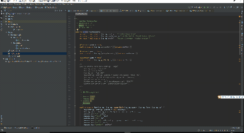

# MyPlugin
### Introduce ：
* MyPlugin是一款使用在Intellij idea开发工具上的插件。 
* 这款插件的功能很明确，为英文技术文档或者源码手册提供翻译。使用方法上也类似于google的选词翻译。
### 插件开发思路来源 ：
* 开发的想法由来已久，作为国内的程序开发人员，经常会阅读大量开源的英文文档，其中难免遇到阅读障碍。
大多数人的做法会将陌生单词或短语拷贝并切换至外部翻译器，反复的操作难免降低工作效率。
* 结合当今编程世界最火的开发工具Intellij idea，安装并使用该插件可以直接在idea中直接选词翻译。
省去了来回切换的频繁操作，提高了文档阅读和开发效率。

### 效果展示（GIF）：

### 使用方法：
* 选中需要翻译的单词或句子
* 使用快捷键 "Ctrl + Alt + Q"即可快速翻译。 若快捷键冲突，修改冲突的按键或者选择菜单栏中 Code->Translate
* 由于翻译调用有道词典API，存在网络延时，请耐心等待

### 安装方法：
* File -> Setting -> plugins -> install plugin from disk选择压缩包MyPlugin.zip自动安装，重启idea即可

##### 本人水平有限，望各路大神给出意见和建议，或者clone后修改后提交，帮助插件越做越好。
##### Note : 从git上clone到本地之后，不要用idea直接open工程，要选择File->New->Project from Existing Source中导入项目，否则不支持plugin的启动